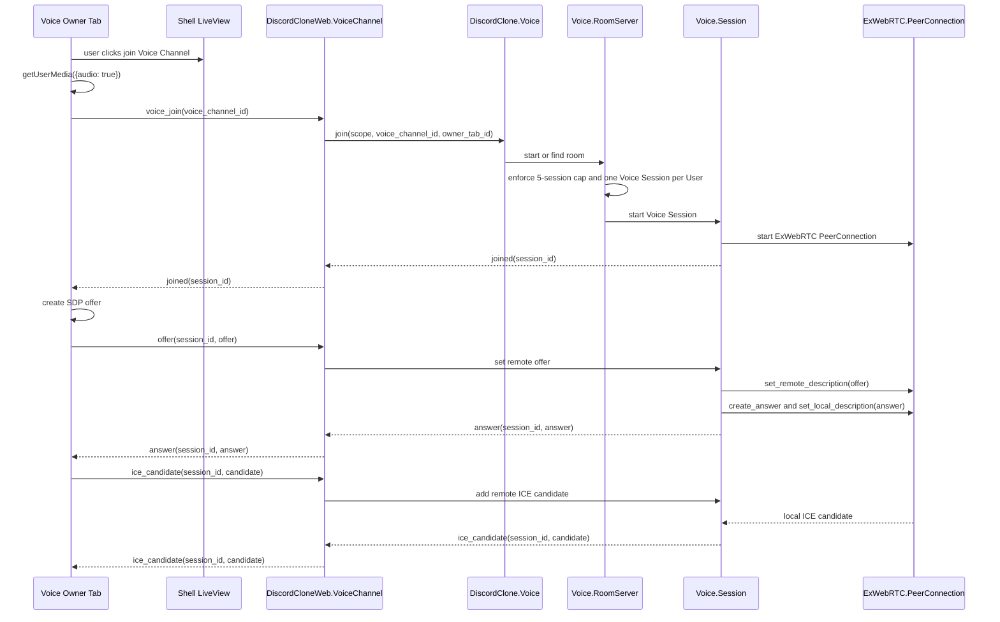
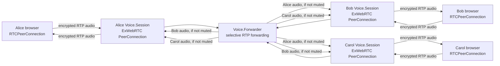
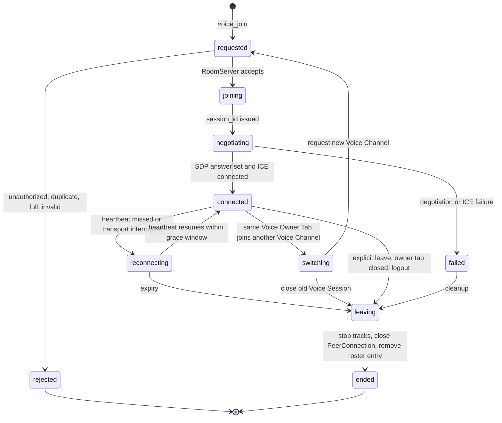

# Use ExWebRTC server-routed Voice Channels

Status: accepted

Voice Channels are an educational, Elixir-owned WebRTC feature: each browser
connects to one server-side `ExWebRTC.PeerConnection`, Phoenix Channels carry
signaling and control messages, and audio flows through WebRTC RTP/SRTP rather
than LiveView, PubSub, or Phoenix Channel payloads. This deliberately keeps the
first version small, audio-only, and capped at five active Voice Sessions per
Voice Channel so the project can learn Phoenix Channels, OTP ownership,
WebRTC negotiation, ICE, RTP forwarding, cleanup, and observability without
claiming to be a production-scale voice system.

Voice Channels are durable `Workspaces` resources, not `Conversation` subtypes.
Conversations own message timelines, sequencing, read state, unread spans,
activity items, and the existing chat runtime; Voice Channels do not contain
Messages and instead create ephemeral Voice Sessions while Users are connected.

## Control plane



## Media plane



## Process ownership

| Owner | Owns | Does not own |
| --- | --- | --- |
| `DiscordClone.Workspaces` | durable Voice Channel identity, workspace association, ordering, authorization through Workspace Membership | active Voice Sessions, WebRTC protocol state, RTP forwarding |
| `DiscordClone.Voice.RoomServer` | active Voice Sessions for one Voice Channel, five-session cap, one active Voice Session per User, roster broadcasts, switch coordination | durable workspace membership source of truth, browser devices |
| `DiscordClone.Voice.Session` | one server-side `ExWebRTC.PeerConnection`, SDP/ICE application, connection state, heartbeat state, per-session cleanup | durable Voice Channel identity, other sessions' browser resources |
| `DiscordClone.Voice.Forwarder` | selective RTP forwarding between Voice Sessions in one Voice Channel, including not forwarding muted source audio or audio to deafened sinks | audio mixing, transcoding, recording |
| `DiscordCloneWeb.VoiceChannel` | authenticated Phoenix signaling adapter, topic authorization, payload validation, replies/events to the browser | long-lived roster truth, cap enforcement, PeerConnection lifecycle |
| Shell LiveView and browser JS | Voice Owner Tab controller, microphone permission, local track lifecycle, remote audio playback, visible controls and roster UI | server authorization, durable state, RTP route ownership |
| Postgres/Ecto | durable Voice Channel rows and workspace relationships | active roster, PIDs, ICE state, RTP route maps, speaking state |

## Voice Session state machine



## Signaling contract

Client to server:

```text
voice_join
offer
ice_candidate
leave
mute_changed
deafen_changed
heartbeat
```

Server to client:

```text
joined
answer
ice_candidate
voice_session_joined
voice_session_left
mute_changed
deafen_changed
connection_state
error
```

The browser creates the SDP offer and the server answers with ExWebRTC. Messages
after `joined` include the server-issued `session_id`. SDP and ICE payloads are
validated as structured JSON and must not be logged in full because they may
contain credentials.

## Alice-to-Bob audio

1. Alice joins a Voice Channel from one Voice Owner Tab.
2. The server authorizes Alice through Workspace Membership and creates one
   Voice Session for her in that Voice Channel.
3. Alice's browser captures microphone audio and negotiates one
   `RTCPeerConnection` with Alice's server-side `ExWebRTC.PeerConnection`.
4. Bob joins the same Voice Channel and receives his own Voice Session and
   server-side `ExWebRTC.PeerConnection`.
5. Alice's browser sends encrypted RTP audio to Alice's Voice Session.
6. The Forwarder receives Alice's RTP packets from Alice's Session and forwards
   them to Bob's Session, unless Alice is muted or Bob is deafened.
7. Bob's server-side PeerConnection sends the forwarded audio to Bob's browser,
   where the Voice Owner Tab plays it.
8. Bob's audio follows the same path in reverse. Alice never receives her own
   audio back.

## Scope and deferrals

The first version is audio-only, uses selective RTP forwarding only, and has a
hard cap of five active Voice Sessions per Voice Channel. A User may keep the
app open in multiple tabs, but only one Voice Owner Tab owns that User's active
Voice Session; other tabs may continue normal app usage without creating or
reusing the WebRTC connection.

Deferred, not rejected:

- video
- screen sharing
- recording and transcription
- mesh browser-to-browser voice
- production-scale SFU/media-server integration
- more than five active Voice Sessions per Voice Channel
- multi-device voice for the same User
- server-authoritative multi-tab ownership (Phase 2 provides only a
  best-effort browser-side handoff)
- device picker
- push-to-talk
- voice activity detection and speaking indicators
- server moderation actions such as server mute, server deafen, disconnect, and move user
- real TURN deployment beyond documenting the configuration shape
- reconnect recovery beyond heartbeat expiry and explicit leave cleanup

## Dependency decision

The project will use `ex_webrtc` for server-side WebRTC PeerConnections. Phase 0
records the decision, but the dependency should be added and pinned when the
first browser-to-ExWebRTC implementation begins so that the project selects a
current stable Hex release at implementation time.
