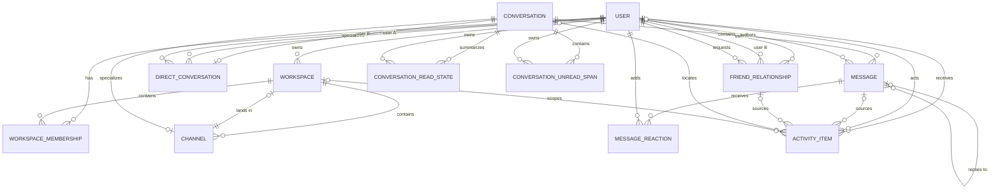

# Friendships and Direct Messages Design

This document consolidates the locked design produced by the Friendships and Direct Messages grilling session. It is a design artifact, not an implementation plan or authorization to change application code.

## Scope

- Mutual Friend Requests and Friendships between globally identified Users.
- Exact-username Friend Requests without a browsable global User directory.
- One-to-one Direct Conversations between Friends.
- A shared Conversation foundation for Workspace Channels and Direct Conversations.
- Discord-like Direct Messages navigation with Friends, requests, and recent Direct Conversations.
- Shared replies, reactions, unread tracking, typing, pagination, soft deletion, runtime caching, and Activity integration.
- Minimal global online/offline Friend Presence.

## Non-goals

- Group Direct Conversations; Users use Workspace Channels for group conversation.
- Blocking, idle status, do-not-disturb, invisible mode, custom status, or last-seen history.
- Pinning, hiding, closing, or manually ordering Direct Conversations.
- Per-participant Message hiding or deletion.
- Hard User deletion; a future feature must design deactivation or anonymization.

## Entity relationships



## Target tables

### `friend_relationships`

```text
id                    binary_id primary key
user_a_id             binary_id not null → users.id
user_b_id             binary_id not null → users.id
requested_by_user_id  binary_id not null → users.id
status                string not null: pending | accepted
inserted_at
updated_at
```

Invariants:

- `user_a_id < user_b_id` establishes the canonical pair.
- `{user_a_id, user_b_id}` is unique.
- A User cannot form a relationship with themselves.
- `requested_by_user_id` must equal one member of the pair.
- A same-direction retry is idempotent.
- A reverse pending request accepts the existing relationship.
- Decline, cancellation, and Friend removal delete the relationship row.

### `conversations`

```text
id                binary_id primary key
kind              string not null: workspace_channel | direct
last_message_seq  bigint not null default 0
inserted_at
updated_at
```

The base owns only mechanics shared by every message timeline. Public workflows always create a base row and exactly one matching subtype row in one transaction.

### `channels`

```text
conversation_id  binary_id primary key → conversations.id
workspace_id     binary_id not null → workspaces.id
name             string not null
inserted_at
updated_at
```

Invariants:

- `{workspace_id, name}` is unique.
- The associated Conversation has kind `workspace_channel`.
- `workspaces.default_channel_id` references `channels.conversation_id`.
- Context deletion removes the Conversation parent so subtype rows, Messages, and read state cascade together.

### `direct_conversations`

```text
conversation_id  binary_id primary key → conversations.id
user_a_id         binary_id not null → users.id ON DELETE RESTRICT
user_b_id         binary_id not null → users.id ON DELETE RESTRICT
inserted_at
updated_at
```

Invariants:

- `user_a_id < user_b_id` establishes the canonical pair.
- `{user_a_id, user_b_id}` is unique.
- The associated Conversation has kind `direct`.
- Exactly two Users participate; there is no participant join table.
- Conversation identity is independent from the deletable Friend relationship.

### `messages`

```text
id                    binary_id primary key
conversation_id       binary_id not null → conversations.id
user_id               binary_id → users.id ON DELETE SET NULL
content               text not null
mention_recognition   map not null default {}
seq                   bigint not null
reply_to_message_id   binary_id → messages.id
deleted_at            utc_datetime
deleted_by_user_id    binary_id → users.id ON DELETE SET NULL
inserted_at
updated_at
```

Invariants:

- `{conversation_id, seq}` is unique.
- `seq > 0`.
- A reply target belongs to the same Conversation, precedes the reply, is not the Message itself, and is not deleted.
- Workspace Channels may resolve User and Everyone Mentions.
- Direct Conversations do not create mention recognition or mention Activity Items.
- Direct Message authors may soft-delete their own Messages for both participants; the row and timeline position remain as a placeholder.

### `message_reactions`

The existing Message-owned model remains, with `{message_id, user_id, emoji}` unique. Current Friends may add reactions. Former Friends may remove their own existing reactions but may not add new ones.

### `conversation_read_states`

This generalizes `channel_read_states` by replacing `channel_id` with `conversation_id` while preserving unread summary and last-viewed-anchor semantics. `{conversation_id, user_id}` remains unique.

### `conversation_unread_spans`

This generalizes `channel_unread_spans` by replacing `channel_id` with `conversation_id`. Positive ordered bounds and non-overlap remain enforced per `{conversation_id, user_id}`.

The legacy `channel_reads` cursor model is not part of the target design; no production data requires compatibility preservation.

### `activity_items`

```text
id                             binary_id primary key
kind                           string not null
recipient_user_id              binary_id not null → users.id ON DELETE CASCADE
actor_user_id                  binary_id → users.id ON DELETE SET NULL
source_message_id              binary_id → messages.id
source_friend_relationship_id  binary_id → friend_relationships.id
source_conversation_id         binary_id → conversations.id
workspace_id                   binary_id → workspaces.id
read_at                        utc_datetime_usec
inserted_at
updated_at
```

Kinds:

- `user_mention`
- `everyone_mention`
- `direct_message`
- `friend_request_received`
- `friend_request_accepted`

Message-backed kinds require Message and Conversation sources. Friend-request kinds reference the Friend relationship. Direct Message items have no Workspace. At most one Activity Item exists per recipient and source event.

## Context boundaries

```text
Accounts
  User identity, authentication, credentials, tokens

Friendships
  FriendRelationship and every request/friend lifecycle workflow

Workspaces
  Workspace, Membership, Channel subtype, roles, moderation, invites

Chat
  Conversation base, DirectConversation subtype, Messages, reactions,
  read state, Activity, runtime orchestration, and conversation policy

Presence
  Ephemeral global Friend Presence
```

Dependency direction:

```text
Chat → Friendships → Accounts
Workspaces → Accounts
Presence → Friendships → Accounts
Web → Accounts, Friendships, Workspaces, Chat, Presence
```

Chat does not query `FriendRelationship` directly. Friendships exposes narrow relationship checks and lock-aware authorization functions that participate in the caller's Repo transaction.

## Public workflow shape

Friendships:

```elixir
send_request(scope, recipient_user_id)
send_request_by_username(scope, exact_username)
accept_request(scope, relationship_id)
decline_request(scope, relationship_id)
cancel_request(scope, relationship_id)
remove_friend(scope, friend_user_id)
list_friends(scope)
list_incoming_requests(scope)
list_outgoing_requests(scope)
friends?(scope, other_user_id)
```

Chat:

```elixir
find_or_create_direct_conversation(scope, friend_user_id)
list_direct_conversations(scope)
open_conversation(scope, conversation_id)
send_message(scope, conversation_id, attrs)
toggle_reaction(scope, message_id, emoji)
delete_message(scope, message_id)
mark_messages_visible(scope, conversation_id, from_seq, to_seq)
```

Presence:

```elixir
join(scope, live_view_pid)
subscribe_to_friend(scope, friend_user_id)
list_online_friend_ids(scope)
```

## Direct Message authorization

| Action | Current Friend | Former Friend | Non-participant |
|---|---:|---:|---:|
| Read history | Yes | Yes | No |
| Send or reply | Yes | No | No |
| Broadcast typing | Yes | No | No |
| Add reaction | Yes | No | No |
| Remove own reaction | Yes | Yes | No |
| Delete own Message | Yes | Yes | No |
| Delete other User's Message | No | No | No |
| View Friend Presence | Yes | No | No |

## Critical transactions and locks

Direct Message send uses this lock order:

```text
Friend relationship FOR SHARE
→ Conversation FOR UPDATE
→ recipient Conversation Read State FOR UPDATE
```

Friend removal locks the relationship `FOR UPDATE`. If send locks first, its Message commits before removal; if removal locks first, send returns `:not_friends`. Every Message insert, sequence increment, recipient unread update, and Direct Message Activity Item insert commits atomically. PubSub broadcasts occur only after commit.

Crossed Friend Requests attempt a conflict-safe canonical-pair insert, then lock the resulting relationship row `FOR UPDATE`. A reverse pending requester changes the single row to `accepted`; same-direction retries return the existing pending relationship.

## Activity and visibility

- Every received Direct Message creates a `direct_message` Activity Item.
- A colocated LiveView hook uses `IntersectionObserver`, a continuous one-second timer, document visibility, and window focus to identify genuinely viewed Messages.
- One server transaction subtracts visible unread spans and marks matching Direct Message Activity Items read.
- Read Direct Message Activity Items disappear from the primary unread activity view but remain in Activity history.
- Mention Activity Items retain their existing independence from Channel Read State.
- Incoming requests create `friend_request_received`; acceptance creates `friend_request_accepted`; declines remain silent; cancellation removes the pending received-request item.

## Runtime and PubSub

- `ConversationServer` replaces Channel-only runtime identity and is keyed by `conversation_id` in a Registry/DynamicSupervisor pair.
- It owns recent-message cache and transient typing state only, retains the existing idle shutdown policy, and reloads recent Messages from PostgreSQL after restart.
- Authorization occurs in Chat/Friendships before runtime calls; the process does not own durable access policy.
- Conversation topics use `chat:conversation:{conversation_id}` with narrower reaction/read-state topics where useful.
- Activity, friendship, and Friend Presence broadcasts use private User topics.
- An open Direct Conversation remains subscribed after unfriend, immediately recomputes capabilities, stops typing, hides Friend Presence, and becomes read-only without redirecting.
- `UserPresenceServer` is dynamically supervised per connected User, monitors all authenticated LiveView PIDs, broadcasts only zero/nonzero connection transitions, and stops when the final connection exits.

## Routes and UI shell

All routes belong inside the existing `scope "/", DiscordCloneWeb`, `pipe_through [:browser, :require_authenticated_user]`, and existing `live_session :require_authenticated_user` because every workflow requires `current_scope`.

```text
/direct-messages
/direct-messages/requests
/direct-messages/:conversation_id
```

The persistent destination rail shows Direct Messages above Workspace icons. The Direct Messages sidebar contains Friends, pending requests, and all created Direct Conversations. Conversations include empty and former-Friend read-only entries, sort by latest Message activity with creation time as the empty fallback, and move live when activity arrives. No hide, pin, close, or manual ordering is included initially.

## Database migration posture

There is no persistent application data to preserve. Implementation should still generate migrations with `mix ecto.gen.migration`, but it may reshape Message ownership, read-state tables, runtime identity, and constraints directly without compatibility backfills or dual-read/dual-write phases. The finished implementation must run `mix precommit` and fix every reported issue.
