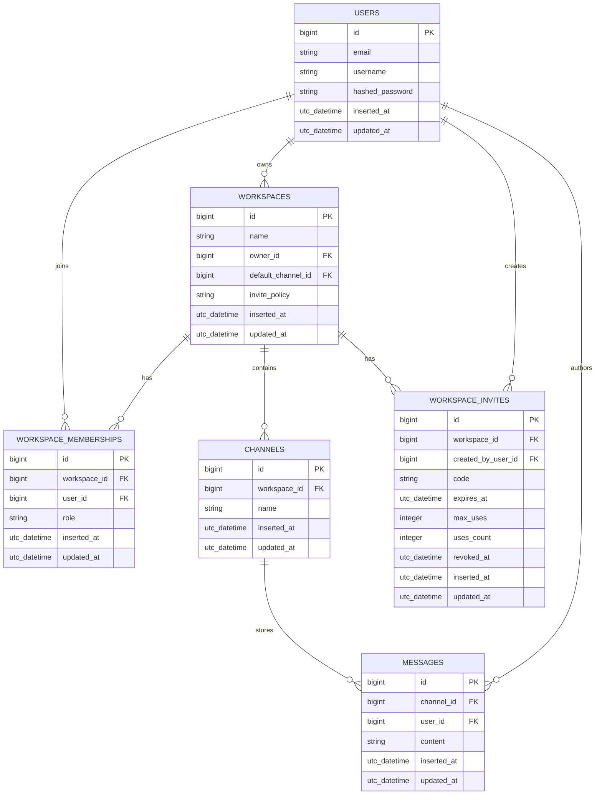

# Entity Relationships

This document describes the first durable domain model for the Discord clone.
The project uses Postgres for information that must survive restarts, and OTP
processes for short-lived channel state.

## Core Model



## Relationship Decisions

### Users

A user represents an account that can log in, join workspaces, create
workspaces, and author messages.

- `users.email` should be unique.
- `users.username` can be unique globally for the learning version.
- Authentication data belongs only on `users`.

### Workspaces

A workspace is the top-level collaboration boundary.

- A workspace belongs to one owner through `owner_id`.
- A workspace has many channels.
- A workspace has many users through `workspace_memberships`.
- The owner should also have a membership row so membership checks have one
  consistent path.
- A workspace has one default channel through `default_channel_id` when created
  through the public workspace workflow.
- `default_channel_id` is expected to point at the workspace's landing channel.
  A missing default channel is treated as broken workspace state, not a normal
  product state.
- The UI can call a selected default the "Main channel", but the database field
  should stay precise and system-oriented.
- A workspace has an invite policy, starting with `owner_only` or
  `members_can_invite`.

Workspace creation should happen in a transaction:

1. Create the workspace.
2. Create the owner's `workspace_membership`.
3. Create the default `general` channel.
4. Store that channel ID on `workspaces.default_channel_id`.

Channel creation is a separate workflow. Creating a channel does not update
`workspaces.default_channel_id`. Workspace entry should resolve the landing
channel by reading the stored default channel.

### Workspace Memberships

Memberships model the many-to-many relationship between users and workspaces.

- Use a unique index on `[:workspace_id, :user_id]`.
- Start with a simple `role` string, such as `owner` or `member`.
- Leaving a workspace deletes the membership, not the user.
- Workspace access checks should use this table.

### Channels

A channel belongs to one workspace and groups messages plus live process state.

- Use a unique index on `[:workspace_id, :name]`.
- Channel names should be normalized to a predictable format before insert.
- Deleting a channel should delete its messages.
- Every active channel may have one associated `ChannelServer` process.
- New workspaces start with a `general` channel.
- Channel names do not have to remain `general`; renaming the default channel
  later should preserve the landing role because the workspace stores the
  channel ID.
- A workspace created through the public workflow should not have zero channels.
- Deleting the default channel should require selecting a replacement first.

### Workspace Invites

Invites model how users join existing workspaces.

- An invite belongs to one workspace.
- An invite belongs to the user who created it through `created_by_user_id`.
- An invite grants membership to the workspace, not to one channel.
- After accepting an invite, the user should land in the workspace's landing
  channel.
- Use a unique index on `code`.
- `expires_at`, `max_uses`, and `revoked_at` make invites easy to invalidate
  without deleting audit history.

Invite redemption should happen in a transaction:

1. Find the invite by `code`.
2. Reject revoked, expired, or fully-used invites.
3. Create the `workspace_membership` if the user is not already a member.
4. Increment `uses_count`.
5. Navigate the user to the workspace landing channel.

### Messages

A message is durable chat history.

- A message belongs to one channel.
- A message belongs to one author.
- Message queries should preload the author before rendering templates that show
  `message.user.username`.
- Messages are never stored as the complete source of truth inside a GenServer.
- Channel entry should load the latest page of messages from Postgres, starting
  with 50 messages.
- Older history should be loaded from Postgres as the user scrolls upward.

## Message Flow

Sending a message must be a persist-first operation:

1. Validate that the user belongs to the message channel's workspace.
2. Insert the message in Postgres.
3. Update the channel process recent-message cache.
4. Broadcast the persisted message with PubSub.

This order keeps message history correct even if the channel process crashes
during or after the send flow. The UI may briefly miss a broadcast, but a reload
or history fetch will recover the message from Postgres.

## History Loading

Message history should be paginated by cursor, not loaded all at once.

- Initial channel load fetches the latest 50 messages from Postgres.
- The channel process may keep those latest messages as a cache.
- Scrolling upward asks Postgres for older messages before the oldest currently
  rendered message.
- The database remains the source of truth for all history.

Use a stable cursor such as `inserted_at` plus `id` to avoid duplicate or skipped
messages when several messages share the same timestamp.

Example query shape:

```text
latest 50:
  where channel_id = ?
  order by inserted_at desc, id desc
  limit 50

older page:
  where channel_id = ?
  and (inserted_at, id) < (?, ?)
  order by inserted_at desc, id desc
  limit 50
```

The UI can reverse the returned rows before rendering so messages appear oldest
to newest.

## OTP State Boundaries

Channel processes should be addressed by durable channel IDs, not channel names.
Names can change, but IDs are stable.

```elixir
%{
  channel_id: 123,
  online_users: MapSet.new(),
  typing_users: %{},
  recent_messages: [],
  last_activity_at: nil
}
```

Persist in Postgres:

- users
- workspaces
- workspace memberships
- channels
- messages

Keep in OTP process state:

- online users
- typing users
- recent messages cache
- rate-limit counters
- last activity timestamp

Broadcast with PubSub:

- new message events
- typing started or stopped events
- presence changes
- channel process lifecycle events when useful for debugging

## Crash Recovery

Channel process crashes should be boring.

- Durable data is recovered from Postgres.
- The restarted channel process reloads the latest 50 messages when needed.
- Online users are rebuilt as connected LiveViews rejoin the channel process.
- Typing users, rate-limit counters, and activity timestamps may reset.
- The UI should favor clearing temporary state over showing stale presence or
  typing indicators.

Do not persist temporary state just to survive a channel process crash.

## Suggested Contexts

The first implementation can stay simple with three contexts:

- `DiscordClone.Accounts`: users and authentication.
- `DiscordClone.Workspaces`: workspaces, memberships, channels, and access
  checks.
- `DiscordClone.Chat`: messages plus the public API that talks to channel
  processes and PubSub.

The OTP modules can live under `DiscordClone.Chat`, for example:

- `DiscordClone.Chat.ChannelServer`
- `DiscordClone.Chat.ChannelSupervisor`
- `DiscordClone.Chat.ChannelRegistry`

## First Migration Order

1. `users`
2. `workspaces`
3. `workspace_memberships`
4. `channels`
5. `workspace_invites`
6. `messages`

This order keeps foreign keys straightforward and allows each later table to
reference an already-created table.

## Indexing Policy

Add correctness indexes and obvious core-flow indexes early. Add speculative
performance indexes later only after queries or usage prove they are needed.

Indexes make specific lookups, joins, ordering, uniqueness checks, and
pagination faster. They are not free: every insert, update, or delete also has
to maintain the relevant indexes, and indexes take disk space.

Early correctness indexes:

- unique `users.email`
- unique `users.username`
- unique `workspace_memberships(workspace_id, user_id)`
- unique `channels(workspace_id, name)`
- unique `workspace_invites.code`

Early core-flow indexes:

- `workspaces.owner_id`
- `workspace_memberships.user_id`
- `workspace_memberships.workspace_id`
- `channels.workspace_id`
- `workspace_invites.workspace_id`
- `workspace_invites.created_by_user_id`
- `messages.user_id`
- `messages(channel_id, inserted_at, id)`

Do not index every column. Index columns that are part of real access patterns.
For chat history, `messages(channel_id, inserted_at, id)` is justified early
because the channel page always loads and paginates messages by channel and
time.

## Stretch Goal Extensions

These can be added after the core model works:

- Reactions: `message_reactions` with `message_id`, `user_id`, and `emoji`.
- Mentions: parse message content first; persist `message_mentions` only if
  querying mentions becomes important.
- Direct messages: model as a separate conversation type or as channels with a
  `kind` field. For the learning project, using channel processes for DMs is
  reasonable because the live state needs are similar.
- Unread counts: persist per-user read positions with `channel_reads`, not as
  counters on users or channels. A Channel read row stores a User's durable
  message cursor for a Channel in Postgres. ChannelServer must not own read or
  unread state because process memory is allowed to reset on crash, shutdown,
  or reconnect.
